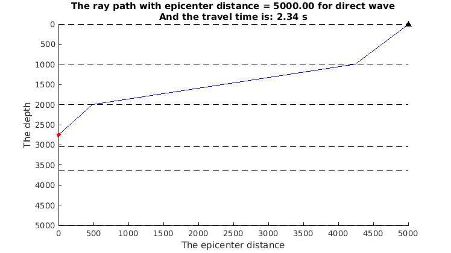
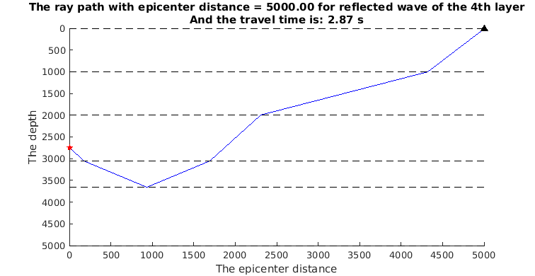

# RT1D

Ray tracing program for 1-D horizontal layered medium.

## License

[The MIT License](http://tchel.mit-license.org)

## Example

Keyboard input in the **matlab** command line window:

```matlab
>> vel = [2000, 3200, 1800, 2800, 4000];
>> dep = [0, 1000, 2000, 3050, 3650, 5000];
>> zs = 2250;
>> delta = 5000;
>> tdw = DW1DRT(zs, delta, vel, dep);
>> rlyr = 4;
>> trw = RW1DRT(zs, delta, rlyr, vel, dep);
```

where there is a 5-layer medium, `vel` is the wave velocity of every layer, and `dep` is the depth of every layer-interface.

In this example, `zs` is the depth of source, `delta` is the horizontal distance between source and station, and `rlyr` is the layer number of reflected layer.

As a result, `tdw` is the travel time of direct wave, and `trw` is the travel time of reflected wave. Besides, the paths of direct wave and reflected wave are showed as follow:





## Reference

_田玥, 陈晓非. 2005. 水平层状介质中的快速两点间射线追踪方法. 地震学报: 27(2), 147-154._

## Author

Tche LIU, seistche@gmail.com, USTC
